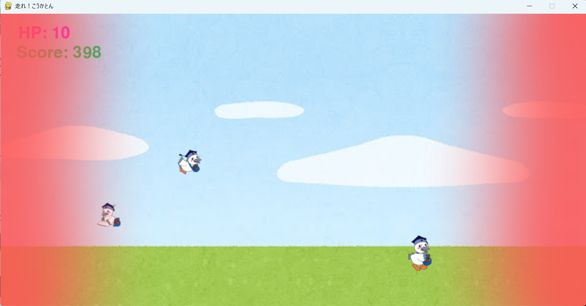

# こうかとんラン

## 実行環境の必要条件
* python >= 3.10
* pygame >= 2.1

## ゲームの概要
* こうかとんが障害物をよけてゴールを目指す
* 敵に触れたら、ゲームオーバーとなる
* 参考URL：[Chrome Dino ゲームオンライン](https://dinorunner.com/jp/)

## ゲームの遊び方
* エンターキーでゲームスタート
* ランダムに敵が流れてくるので矢印キーを使って回避しよう
* HPが0になるとゲームオーバー
* 最高スコアを目指してプレイしよう
### 操作方法
* 上矢印キー：ジャンプ
* 下矢印キー：しゃがむ
* 左矢印キー：左へ移動
* 右矢印キー：右へ移動

## ゲームの実装
### 共通基本機能
* 背景画像と主人公キャラクターの描画

### 分担追加機能
* 敵・当たり判定機能（担当：ふかさわ）：ランダムで敵が出現する
* HP・スコア機能（担当：たけはら）：HP・スコアの表示機能
* 見た目変更機能（担当：さの）：体力に応じた見た目の変更・背景の変更
* 移動系機能（担当：まつだ）：ジャンプ、しゃがみなどの追加
* タイトル画面機能（担当：ひぐち）：前回のスコアなど
以下は時間あれば
* ステージ機能：ステージが変化する機能
* アイテム機能：アイテムが流れてくる機能orアイテムを使用できる機能
* 複数のキャラクター機能：それぞれ特徴のあるキャラクターを選択できる機能
* 音が出る機能：場面に応じた音が鳴る機能

### ToDo
- [ ] BGM流す
- [ ] こうかとんと障害物の衝突判定を調整

### メモ
* chomeのオフラインゲーム風に
